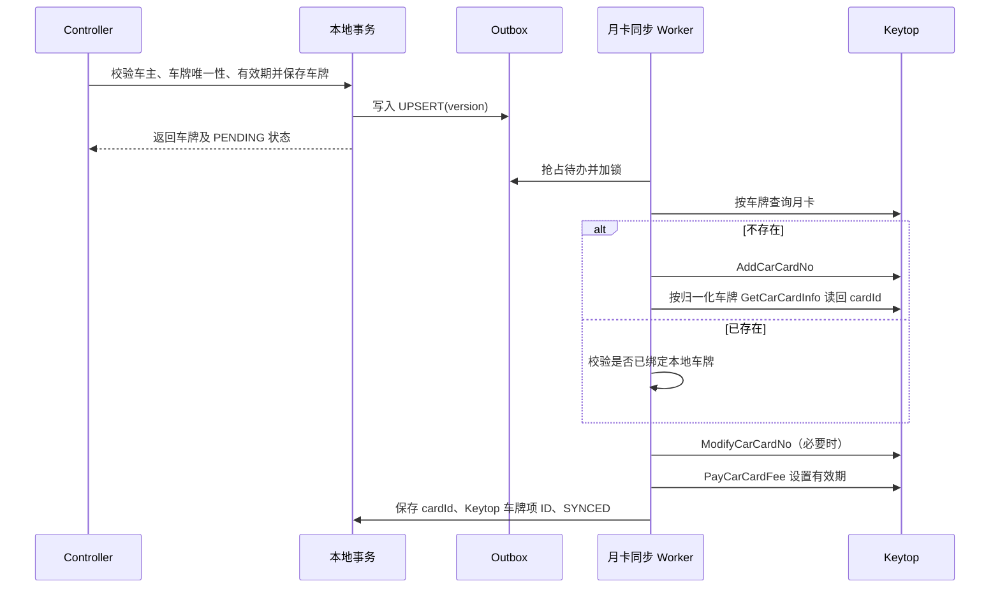

# 车牌与 Keytop 月卡同步方案

## 1. 背景与目标

车辆进出权限由 Keytop 月卡控制。一个车主可以登记多辆车，一个车牌只代表一辆车；系统中的每个有效车牌都必须对应 Keytop 的一张月卡。

本方案覆盖以下操作：

- 新建车牌时创建并启用对应月卡；
- 修改车牌号、车主、车牌状态或月卡有效期时修改对应月卡；
- 删除车牌时删除对应月卡；
- Keytop 超时、重复请求、网络中断、服务重启或接口返回不完整时，仍可重试并最终收敛；
- 管理员可以看到同步状态、失败原因和最后一次 Keytop 卡号，并可人工重试或执行对账。

本期只设计车牌档案与月卡的同步，不改变车辆进出记录同步、黑名单同步和车位区域同步。

## 2. 当前实现与差距

当前代码已经具备 Keytop 月卡客户端能力：

- `ParkingApiController` 提供 `POST/PUT/DELETE /api/parking/plates` 车牌写接口；
- `ParkingOwner` 与 `ParkingPlate` 通过 `ownerId` 形成一对多关系，车主已有姓名、电话、部门和状态字段；
- `KeytopService` 已封装 `AddCarCardNo`、`GetCarCardInfo`、`ModifyCarCardNo`、`DelCarCardInfo`、`PayCarCardFee`；
- 车辆进出申请已经实现“查询已有卡 -> 新增月卡 -> 读回卡号 -> 缴费/设置有效期”的部分流程；
- `KeytopServiceImpl` 已负责签名、超时、HTTP 错误和响应码解析，成功码当前按 `0` 判断。

目前车牌写接口只保存本地数据并刷新车主计数，没有 Keytop 卡号、同步状态、失败重试和删除待办记录。`ParkingPlate` 也没有月卡有效期字段，因此无法仅靠现有字段可靠地完成“创建后缴费并启用”流程。现有车辆进出申请中的 `plateNoInfo.id = cardId` 只能作为历史兼容逻辑，不能直接假定 Keytop 的车牌项 ID 与月卡 ID 相同；同步模块必须按真实响应解析并保存两个 ID（若 Keytop 返回）。

## 3. 领域约束与唯一关系

### 3.1 本地关系

```text
ParkingOwner 1 ---- N ParkingPlate 1 ---- 1 KeytopMonthlyCard
```

- 一个车主可以有多个车牌；
- `ParkingPlate.plate` 在本地唯一，比较和发送 Keytop 前使用统一的车牌归一化规则（沿用 `PlateNumbers.normalize`）；
- 一个本地车牌最多绑定一个 Keytop `cardId`；
- 一个 Keytop 月卡在本系统最多绑定一个本地车牌。发现同一 Keytop 卡或同一车牌被多个本地记录占用时，任务进入 `BLOCKED`，不得自动覆盖；
- `status = 1` 表示本地车牌业务启用，不能直接等同于 Keytop 已生效。只有本地状态启用且月卡同步成功，车辆才具备完整进出权限。

### 3.2 月卡字段映射

| 本地字段 | Keytop 字段 | 规则 |
| --- | --- | --- |
| `ParkingPlate.plate` 归一化值 | `plateNoInfo[].plateNo` | 创建、修改、查询和删除均使用归一化值 |
| `ParkingOwner.name` | `cardInfo.useName` | 车主变更时同步修改 |
| `ParkingOwner.phone` | `cardInfo.tel` | 车主电话变更时同步修改 |
| 车牌本地编号 | `cardInfo.cardName` / `remak` | 建议使用稳定名称，如“车牌月卡-plate-{id}”，备注带本地 ID，禁止使用易变姓名作为唯一标识 |
| `ParkingOwner.departmentCode` 或配置的区域编码 | `cardInfo.roomId`、`carLotList` | 仅在 Keytop 车场实际要求时发送；没有可用车位时发送空列表，不虚构车位 |
| `monthlyCardValidFrom` | `PayCarCardFee.validFrom` | ISO-8601 `LocalDateTime`，不使用自定义格式 |
| `monthlyCardValidTo` | `PayCarCardFee.validTo` | 必须不早于开始时间 |
| `keytopCardId` | `cardInfo.cardId`、删除请求 `cardId` | 由 Keytop 读回后保存，不能由本地 ID 推导 |

Keytop 的 `cardInfo`、`carLotList`、`plateNoInfo` 在 HTTP 业务参数中是 JSON 字符串，不是嵌套 JSON 对象；同步服务应继续复用 `KeytopService`，禁止在控制器中自行拼接签名或请求体。

## 4. 数据模型变更

### 4.1 `parking_plate` 增加的业务字段

建议在 `ParkingPlate` 增加以下字段（字段命名以 Kotlin 属性为准，数据库命名沿项目 snake_case 规则）：

| 字段 | 类型 | 说明 |
| --- | --- | --- |
| `keytopCardId` | `Long?` | Keytop 月卡 ID；删除完成前保留，便于补偿 |
| `keytopPlateId` | `Long?` | Keytop 月卡详情中车牌项 ID，若接口返回 |
| `monthlyCardValidFrom` | `LocalDateTime?` | 月卡生效时间 |
| `monthlyCardValidTo` | `LocalDateTime?` | 月卡失效时间 |
| `keytopSyncStatus` | 枚举/字符串 | `PENDING`、`PROCESSING`、`SYNCED`、`FAILED`、`BLOCKED`、`DELETE_PENDING`、`DELETED` |
| `keytopSyncVersion` | `Long` | 每次影响 Keytop 的变更递增，用于丢弃旧任务 |
| `keytopLastSyncedAt` | `LocalDateTime?` | 最近一次成功同步时间 |
| `keytopLastError` | `String?` | 最近一次失败摘要，限制长度，例如 2048 字符 |
| `keytopSyncRequestId` | `String?` | 最近一次 Keytop 请求的 `reqId`，便于排查 |

有效期字段必须在创建车牌时明确来源。推荐方案是由车牌接口接收 `monthlyCardValidFrom`、`monthlyCardValidTo`，未传时由明确的业务配置生成；不建议使用“当前时间加一个月”这类隐藏默认值。前端和后端传输格式统一为 `yyyy-MM-dd'T'HH:mm:ss` 的 ISO_LOCAL_DATE_TIME。

### 4.2 事务待办表（Outbox）

为避免删除本地车牌后丢失月卡信息，增加独立的 `parking_plate_keytop_sync_task` 逻辑表。它不是对外业务实体，字段建议如下：

| 字段 | 说明 |
| --- | --- |
| `id` | 任务 ID |
| `plate_id` | 本地车牌 ID，可为空（历史数据或删除后仅保留快照） |
| `operation` | `UPSERT` 或 `DELETE` |
| `version` | 对应 `ParkingPlate.keytopSyncVersion` |
| `plate_snapshot` | 任务创建时的车牌、车主、电话、有效期、卡号和区域快照 |
| `old_plate_no` | 改车牌号时的旧归一化车牌，用于查找旧卡 |
| `keytop_card_id` | 删除或修改时优先使用的卡号 |
| `idempotency_key` | `plateId:version:operation`，唯一约束 |
| `status` | `PENDING`、`PROCESSING`、`SUCCEEDED`、`RETRYING`、`DEAD` |
| `attempts`、`next_attempt_at` | 重试控制 |
| `last_error`、`last_req_id` | 诊断信息 |
| `created_at`、`started_at`、`finished_at` | 审计时间 |

车牌新增、修改、删除和 outbox 任务必须在同一个本地事务中提交。删除操作先写入包含卡号/旧车牌快照的 `DELETE` 任务，再删除 `parking_plate`；禁止先删除实体再尝试临时查询 Keytop。

## 5. 同步流程设计

### 5.1 新建车牌（UPSERT）



1. 本地事务只负责校验和落库，不在数据库事务中调用 Keytop。
2. Worker 先按本地卡号查询；没有卡号时按归一化车牌查询，避免请求重试导致重复发卡。
3. 新增接口返回 `202 Accepted` 语义的同步结果（若保持现有响应码，则响应中必须明确 `keytop_sync_status = PENDING`），前端不能把本地保存成功显示成“月卡已生效”。
4. `AddCarCardNo` 成功但没有返回卡号时，任务进入“结果不确定”处理：先查询车牌，查到则继续；查不到才重试新增。

### 5.2 修改车牌

以下修改都产生新的 `UPSERT` 版本：车牌号、车主、车主电话、部门/区域、启用状态、月卡有效期和需要映射到 Keytop 的备注。

- 车牌号未变：使用 `keytopCardId` 调用 `ModifyCarCardNo`，同步车主和有效期；
- 车牌号改变：任务同时保存旧车牌号，优先按 `keytopCardId` 修改；若卡号缺失，按旧车牌查询。确认旧卡属于本地记录后，再把车牌项改为新车牌；
- Keytop 不允许在原卡上换牌或返回冲突时，任务进入 `BLOCKED`，由管理员确认后执行“新卡创建成功 -> 旧卡删除”的替代流程，不能自动遗留两张可通行月卡；
- 旧版本任务开始执行时，如果数据库中的 `keytopSyncVersion` 已更大，旧任务直接标记成功/跳过，不得覆盖新数据。

### 5.3 删除车牌

1. 本地事务写入 `DELETE` outbox（保存 `keytopCardId`、旧归一化车牌和本地快照）并删除车牌。
2. Worker 优先按 `keytopCardId` 调用 `DelCarCardInfo`；卡号缺失时按旧车牌查询后再删除。
3. Keytop 返回“卡不存在”或查询不到卡时视为删除幂等成功，任务置为 `SUCCEEDED`，本地状态置为 `DELETED`。
4. 删除失败不恢复本地车牌；任务保留并重试，直到成功或进入 `DEAD`，管理员仍可查看删除失败的卡号和车牌。

## 6. 状态机与错误处理

```text
PENDING/DELETE_PENDING -> PROCESSING
PROCESSING -> SYNCED/DELETED
PROCESSING -> RETRYING -> PROCESSING
PROCESSING -> BLOCKED       （数据冲突、字段不确定、重复绑定）
RETRYING -> DEAD             （超过最大次数或人工判定不可重试）
```

错误分类：

- 可重试：连接超时、HTTP 5xx、限流、临时 DNS/网络错误；
- 不可自动重试：参数校验失败、车场/区域不存在、Keytop 明确返回重复绑定或权限错误；
- 结果不确定：请求超时但服务端可能已受理。必须先查询再决定新增、修改或删除，不能直接重复写；
- 本地数据冲突：一个 Keytop 卡已绑定另一车牌、同一车牌查出多张卡、旧版本覆盖新版本，进入 `BLOCKED`。

默认重试建议：指数退避 `1m、5m、15m、1h、6h`，加 10% 随机抖动，最多 8 次；超过次数进入 `DEAD` 并告警。每个车牌同一时间只允许一个 Worker 执行，跨车牌并发数和 Keytop QPS 通过配置限制。

## 7. 对账与人工运维

增加“车牌月卡对账”任务，建议每小时处理失败/待同步记录，每日全量抽样或全量对账：

- 从本地读取启用车牌及 `keytopCardId`；
- 通过 `GetCarCardInfo(cardId/plateNo)` 或分页 `GetCarCardList` 获取 Keytop 状态；
- 比较车牌号、车主电话、有效期、卡状态和绑定关系；
- 发现本地成功但 Keytop 缺卡、车牌不一致或有效期过期时，生成新的 `UPSERT` 任务；
- 发现 Keytop 存在无法归属本地的月卡时只告警，不自动删除。

建议提供以下管理能力：

- 按车牌查询同步详情和最近错误；
- 对单条 `FAILED/BLOCKED/DEAD` 任务人工重试；
- 对指定车牌执行“重新读取 Keytop 并修复”；
- 查看同步任务分页、耗时、请求 ID、Keytop 响应码和脱敏错误；
- 批量对账，但保留并发和速率限制。

新增权限建议为 `plate:sync:read`、`plate:sync:retry`、`plate:sync:reconcile`，继续使用现有 `plate:read`、`plate:manage` 控制车牌数据访问。

## 8. API 变更建议

现有接口保持路径不变：

- `POST /api/parking/plates`：增加月卡有效期入参，返回 `keytop_sync_status`、`keytop_card_id`（可能为空）和 `keytop_sync_message`；
- `PUT /api/parking/plates/{id}`：修改会递增同步版本并生成新的 outbox；响应返回最新状态；
- `DELETE /api/parking/plates/{id}`：返回删除任务 ID 和 `DELETE_PENDING`，而不是声称 Keytop 已立即删除；
- `GET /api/parking/plates`：列表增加同步状态、卡号、最近同步时间和错误摘要，支持按同步状态过滤；
- `POST /api/parking/plates/{id}/keytop-sync/retry`：仅重试指定车牌当前最新版本；
- `POST /api/parking/plates/keytop-sync/reconcile`：管理员触发对账，返回任务运行 ID。

Controller 遵循项目约定：HTTP 参数直接声明、字段使用 snake_case JSON 名称、响应类在 endpoint 内声明、通过 `ResponseBuilder` 构造统一响应；Keytop 组装、解析和重试均放在服务层。

## 9. Keytop 客户端改造点

1. 保持 `KeytopService` 作为唯一外部调用入口，新增一个面向月卡同步的领域服务，不让 Controller 直接依赖 HTTP 客户端。
2. 为月卡详情定义稳定的解析模型，至少解析 `cardId`、车牌项 `id`、车牌号、车主、有效期和状态；对 `data` 为空、字符串 JSON、字段类型变化返回可诊断错误。
3. `KeytopServiceImpl` 的日志必须脱敏：不要记录 `appSecret`、签名 `key`、完整电话号码；保留 `reqId`、serviceCode、HTTP 状态、Keytop code 和耗时。
4. 所有日期使用 `LocalDateTime` 和 ISO_LOCAL_DATE_TIME 在本地 API 传输；只有 Keytop 协议适配层转换为其要求的格式。
5. 由配置提供操作人 ID、默认车场区域、超时、最大重试、并发数和对账周期；不要在同步服务中写死现有车辆进出申请使用的 `1L` 操作人。

## 10. 事务、并发与幂等要求

- 车牌本地写入和 outbox 写入必须在一个事务中；Worker 更新状态使用乐观锁或 `SELECT ... FOR UPDATE SKIP LOCKED`，避免多实例重复执行；
- 同一 `plateId` 按 `keytopSyncVersion` 串行处理；只允许最新版本最终写回本地卡号和状态；
- `UPSERT` 的唯一幂等键是 `plateId + version + operation`，Keytop 无原生幂等键时通过“查询后写入”和结果不确定补偿实现业务幂等；
- 删除任务不能因本地实体已删除而丢失，outbox 必须独立保留；
- Worker 不把外部调用包在本地长事务中，避免连接占用和锁持有时间过长；
- 所有状态转换写审计日志，审计中记录本地车牌 ID、脱敏车牌、操作类型、旧/新版本、Keytop 请求 ID、结果码和错误摘要。

## 11. 测试计划

### 单元测试

- 车牌归一化、有效期校验、Keytop 请求字段映射；
- 成功码、业务失败、HTTP 5xx、超时、空数据和非法 JSON 的分类；
- 新增后读回卡号、已有卡认领、卡号冲突和重复车牌；
- 修改车牌号的旧车牌查询与版本覆盖；
- 删除成功、卡不存在幂等成功、删除超时重试；
- 指数退避、最大次数、`BLOCKED/DEAD` 状态转换。

### 集成测试

- 创建车牌事务失败时不产生可执行 outbox；
- 本地保存成功但 Keytop 不可用时，接口返回 PENDING，Worker 后续可重试；
- Worker 执行期间应用重启，任务可被另一实例重新领取；
- 连续修改同一车牌时旧任务不会覆盖新车牌号或新有效期；
- 删除后仍能从 outbox 完成 Keytop 删除；
- 一个车主多个车牌互不串卡，跨部门访问仍遵循现有数据范围；
- 对账能发现本地与 Keytop 的卡号、车牌、状态和有效期差异。

### 验收指标

- 每个有效车牌最终只有一个本地绑定卡号和一个 Keytop 月卡；
- 任意一次超时或进程重启不产生重复通行卡；
- 删除车牌后 Keytop 卡最终被删除，且删除失败可追踪、可重试；
- 管理员能在页面看到 PENDING、FAILED、BLOCKED、DEAD 的原因和处理入口；
- Keytop 密钥、签名和手机号不出现在普通应用日志。

## 12. 实施顺序与待确认事项

建议按以下顺序实施：

1. 先补充领域字段、Keytop 月卡详情解析模型和事务 outbox；
2. 抽取 `PlateKeytopSyncService` 与 Worker，实现新增、修改、删除和重试；
3. 改造车牌 Controller 响应和列表字段，增加状态查询、重试和对账入口；
4. 增加定时对账、监控指标、告警和审计；
5. 先在测试车场灰度，确认 Keytop 对“换车牌、删除不存在卡、空车位列表、有效期续费”的真实行为后再扩大范围。

上线前必须由业务和 Keytop 对接方确认：

- 月卡有效期的来源、默认值和续费规则；
    月卡默认颁发之后有效到手动撤销
- `carLotList` 是否必填，车牌是否允许不绑定车位；
    暂不绑定车位
- 修改接口中车牌项 `id` 的真实含义，是否与 `cardId` 不同；
    是不同
- Keytop 是否允许在同一月卡上直接换车牌；
    月卡和车牌是一对一关系不可更换
- Keytop 的“卡不存在”、重复车牌、已删除卡和缴费成功码的准确返回值；
- Keytop 请求频率、并发限制和是否提供幂等键；
    暂时使用单线程的处理方式，不需要提供幂等键
- 车牌停用时是删除月卡、冻结月卡，还是保留月卡但禁止通行。

本次实施已确认的业务规则：

- 月卡颁发后按长期有效处理，停用或删除车牌时调用删除月卡；
- 暂不绑定 Keytop 车位，`carLotList` 发送空数组；
- Keytop 月卡与车牌严格一对一，不在原月卡上换车牌；改车牌采用删除旧卡后创建新卡；
- 停用车牌后再次启用按新建月卡流程处理；
- 当前按单线程 Worker 执行，不依赖 Keytop 原生幂等键。
  删除月卡，如果后续启用了月卡就走创建那条路
